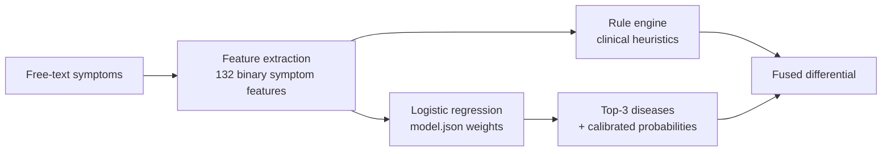
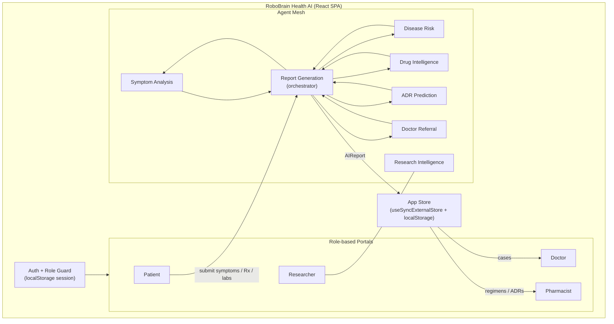
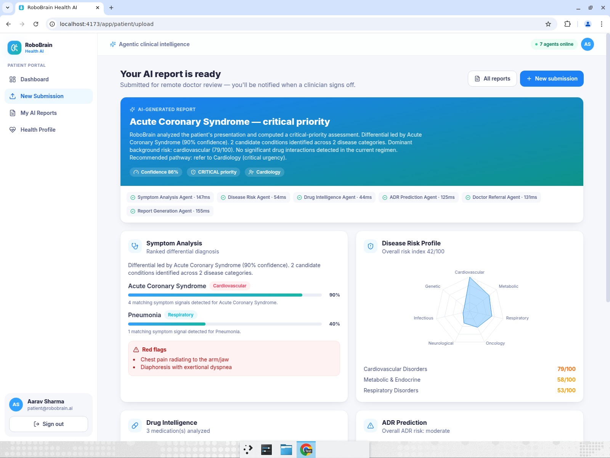
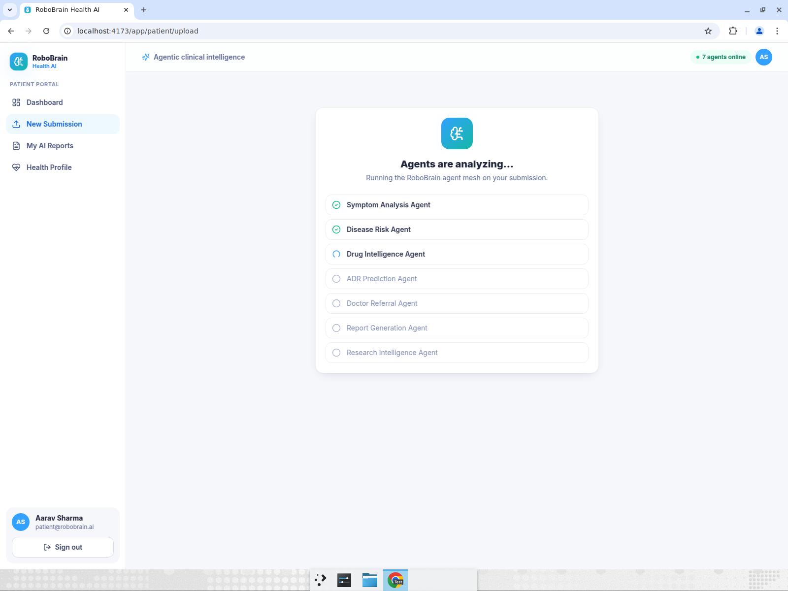
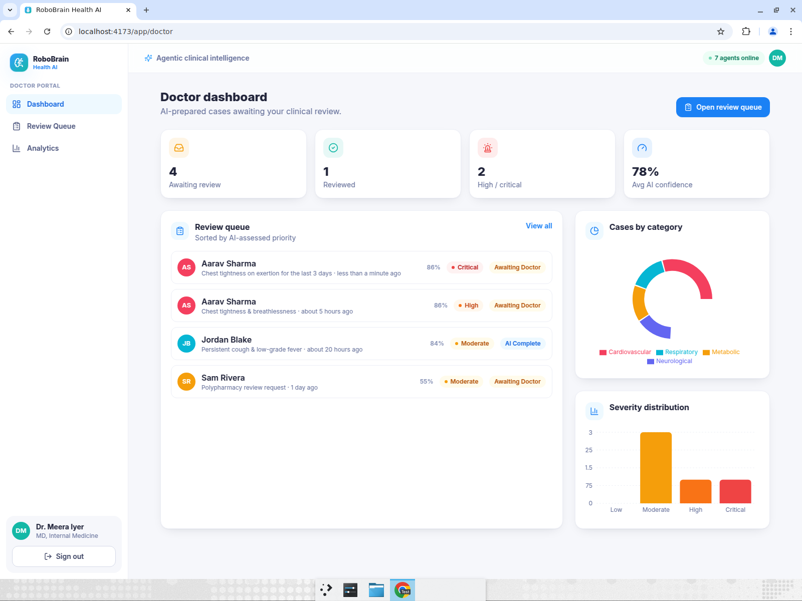
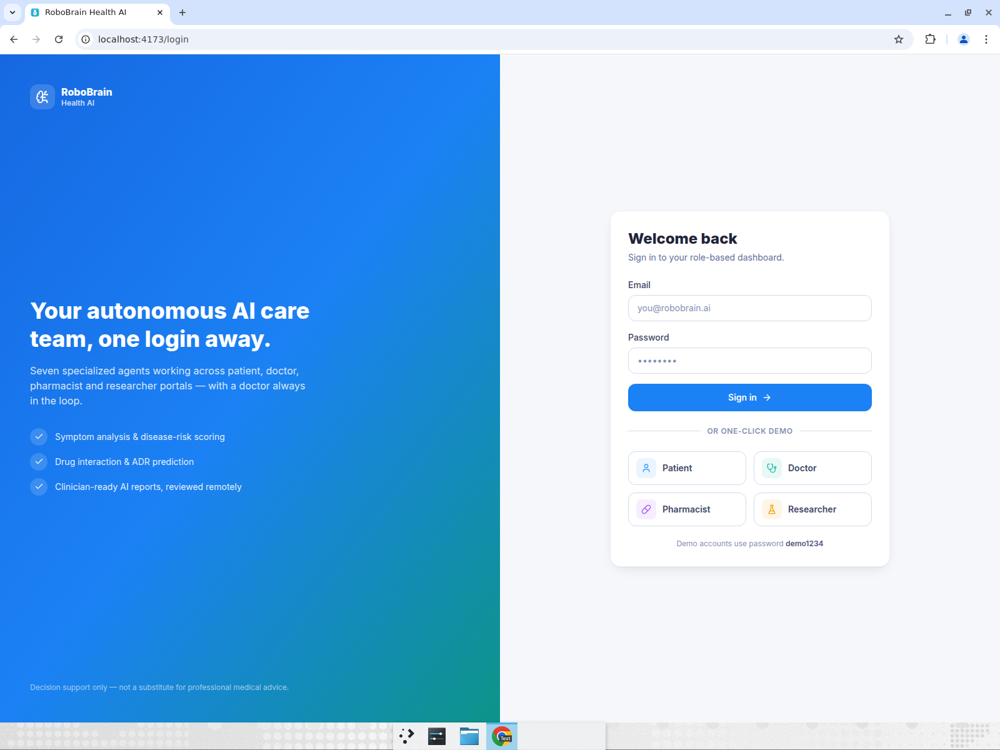

# 🧠 RoboBrain Health AI

> An **agentic & autonomous** healthcare platform — eleven specialized AI agents that analyze symptoms, predict disease risk, audit medications, critique their own diagnoses, and generate safety-checked clinician-ready reports across four role-based portals, with a **doctor always in the loop**.

<p align="center">
  
</p>

<p align="center">
  <em>React • TypeScript • Tailwind CSS • Vite • Recharts</em>
</p>

---

## ✨ Overview

RoboBrain Health AI is a modern, responsive healthcare web platform built around an **agent mesh**: a set of cooperating AI agents, each owning a single clinical task, orchestrated into one explainable assessment.

Patients upload **symptoms, prescriptions and lab reports** and instantly receive an **AI-generated report**. That report is routed for **remote review** by a doctor, audited for drug safety by a pharmacist, and aggregated into population-level signals for researchers — all from the same engine.

> ⚕️ **Disclaimer:** This is a demonstration project for a hackathon. It provides decision support only and is **not** a medical device or a substitute for professional medical advice. All data is synthetic.

---

## 🚀 Key Features

- **Four role-based portals** — Patient, Doctor, Pharmacist, Researcher — each with a tailored dashboard.
- **Eleven specialized AI agents** in a self-critiquing, self-routing mesh with a clean, swappable inference interface.
- **Role-based authentication** with one-click demo login for every role.
- **Streaming AI report pipeline** — watch the agent mesh reason live, then read a safety-checked, consensus report.
- **Doctor-in-the-loop review** — confirm, modify or escalate every AI assessment; corrections feed a learning loop.
- **Multimodal input** — voice (Web Speech API) and prescription-photo OCR (tesseract.js) for low-literacy users.
- **Longitudinal monitoring** — vitals history with risk-trend detection over time.
- **Public-health intelligence** — autonomous outbreak/anomaly detection across the population dataset.
- **Digital twin** — what-if intervention simulator projecting risk reduction.
- **Rich analytics** — radar, area, line, bar and donut charts powered by Recharts.
- **Seven disease categories** mapped across every finding.
- **Fully responsive** — works from mobile to widescreen.
- **Works offline** — Local Reasoner mode runs entirely in the browser with `localStorage` persistence; no API key required.
- **Clean Data Exchange** — every decision-support report exports as a validated **HL7 FHIR R4** bundle (Patient, LOINC-coded vitals Observations, Conditions, MedicationStatements, RiskAssessment, referral ServiceRequest, DiagnosticReport, and AI/clinician Provenance), interoperable with EHRs, HIE gateways and Japan's JP Core profile. Structural validation runs before every export so receiving systems never get a broken payload.

---

## 🤖 The Agent Mesh

### Core clinical agents

| Agent | Responsibility |
|-------|----------------|
| 🩺 **Symptom Analysis Agent** | Parses free-text symptoms into ranked differential diagnoses with confidence scores. |
| 🛡️ **Disease Risk Agent** | Computes multi-category disease risk from vitals, history and lifestyle signals. |
| 💊 **Drug Intelligence Agent** | Reviews prescriptions for interactions, dosing notes and alternatives. |
| ⚠️ **ADR Prediction Agent** | Predicts adverse drug reactions and recommends monitoring plans. |
| ➕ **Doctor Referral Agent** | Routes cases to the right specialty with an urgency level and suggested tests. |
| 📄 **Report Generation Agent** | Orchestrates the other agents into a single, explainable report with a streaming execution trace. |
| 🔬 **Research Intelligence Agent** | Surfaces cohort trends, biomarkers and signals across the population dataset. |

### Innovation agents (new)

| Agent | Responsibility |
|-------|----------------|
| 🔍 **Critic Agent** | Challenges every diagnosis with counter-evidence, proposes alternatives, and produces an adjusted-confidence consensus. |
| 🛡️ **Safety / Guardrails Agent** | Red-flag detection, contraindication checks, and approve / warn / block decisions before output. |
| ❓ **Uncertainty Agent** | Quantifies confidence; can abstain and request additional tests instead of guessing. |
| 🚦 **Triage Agent** | Autonomous escalation routing — doctor / pharmacist / auto-resolve / emergency — with rationale. |
| 🔧 **Tool-Use Agent** | Autonomously calls clinical tools (lab lookup, guideline check) and surfaces results. |

Every agent implements a common `Agent<Input, Output>` interface. They run as **deterministic, explainable inference engines** in the browser (no API keys, no network) by default — and the same interface can be backed by an LLM via the provider toggle in the header.

```ts
export interface Agent<I, O> {
  id: string
  name: string
  model: string
  run(input: I): O
}
```

---

## 👥 Portals & Disease Atlas

| Portal | Highlights |
|--------|-----------|
| **Patient** | Upload symptoms/prescriptions/labs, live agent run, AI reports, editable health profile with real-time risk recompute. |
| **Doctor** | Prioritized review queue, full report view, sign-off (agree / modify / escalate), clinical analytics. |
| **Pharmacist** | Cross-patient drug-interaction feed, interactive regimen builder, ADR watchlist. |
| **Researcher** | Population incidence trends, biomarker signals, cohort explorer, disease atlas. |

**Disease categories:** Infectious Diseases · Cancer & Oncology · Cardiovascular Disorders · Neurological Disorders · Respiratory Disorders · Metabolic & Endocrine Disorders · Genetic & Rare Disorders.

---

## 💡 Innovations

| # | Innovation | What it does |
|---|-----------|--------------|
| 1 | **Critic Agent + consensus debate** | A counter-evidence agent challenges every diagnosis, lowers over-confident scores, and produces an adjusted-confidence consensus. |
| 2 | **Doctor-feedback learning loop** | Doctor corrections are persisted; the Critic Agent self-adjusts future confidences on corrected conditions. |
| 3 | **Safety / Guardrails Agent** | Red-flag detection, contraindication checks, and approve / warn / block decisions before any output reaches the user. |
| 4 | **Uncertainty + abstention** | The mesh quantifies confidence and can abstain ("needs more data") and request additional tests instead of hallucinating. |
| 5 | **Autonomous triage / escalation routing** | Routes each case to doctor / pharmacist / auto-resolve / emergency with a rationale. |
| 6 | **Streaming live reasoning trace** | Per-agent reasoning steps stream live during analysis — a transparent "thinking trace." |
| 7 | **Agentic tool-use** | The agent autonomously calls clinical tools (lab lookup, guideline check) and surfaces results. |
| 8 | **Multimodal voice + OCR input** | Voice-to-symptom (Web Speech API) and prescription-photo OCR (tesseract.js) for low-literacy users. |
| 9 | **Longitudinal vitals history** | Record vitals snapshots over time; see BP trends and a derived risk-index chart with trend alerts. |
| 10 | **Outbreak / anomaly detection** | Autonomous monitoring of case incidence against baselines; flags outbreaks, spikes, and drops in the researcher portal. |
| 11 | **Digital-twin what-if simulation** | Toggle interventions (quit smoking, control BP / cholesterol / glucose, lose weight) and see projected risk change. |
| 12 | **LLM integration with graceful fallback** | A serverless LLM endpoint (OpenAI-compatible) with a header toggle between Local Reasoner and LLM Reasoner. Falls back to deterministic local reasoning when no key is configured. |
| 13 | **Kaggle-trained ML classifier in the browser** | A multinomial logistic-regression model trained on the Kaggle Disease Prediction dataset (4,920 cases, 132 symptoms, 41 diseases), exported to JSON and run with pure TypeScript inference — fused with the rule engine inside the Symptom Analysis Agent. |
| 14 | **LLM-augmented agent mesh** | Seven concurrent LLM tasks refine every agent's output (symptom summary, critic debate, risk insight, drug advice, referral note, uncertainty data requests, report narrative) with per-agent validation and silent local fallback. |

---

## 🤖 ML-Trained Classifier

The Symptom Analysis Agent doesn't just match keywords — it runs a **real trained model** alongside the rule engine:



- **Training**: `ml/train.py` (scikit-learn) trains on the Kaggle *Disease Prediction* dataset and exports the winning model's weights to `ml/model.json`.
- **Inference**: `src/lib/ml/classifier.ts` runs the model in pure TypeScript (dot-product + softmax) — no server, no runtime dependencies. Verified to match sklearn `predict_proba` to within 5e-7. Free-text feature extraction is negation-aware ("no chest pain" does not activate the feature) and covered by unit tests (`npm test`).
- **Honest metrics**: the dataset is synthetic and separable (holdout accuracy 100% for every model), so the meaningful number is the noisy-input eval — **~93% top-1 / 100% top-3 accuracy** when half the symptoms are dropped and noise added (see `ml/eval_report.json`).
- **Retrain**: `pip install scikit-learn pandas numpy && python3 ml/train.py && cp ml/model.json src/lib/ml/model.json`.

When the LLM Reasoner is enabled, each agent's local + ML output is further refined by a dedicated LLM task (see Innovation #14) — all calls run concurrently, are shape-validated, and fall back silently to the deterministic result on any failure.

---

## 🏗️ Architecture



**Data flow:** a patient submission is sent to the **Report Generation Agent**, which fans out to the other agents, collects their structured outputs (plus an execution trace), and writes a single `AIReport` into the shared store. The doctor, pharmacist and researcher portals all read from that same store, so a new submission appears in the doctor's queue immediately.

---

## 🛠️ Tech Stack

- **React 18** + **TypeScript** (strict)
- **Vite 5** build tooling
- **Tailwind CSS 3** for styling
- **React Router 6** (HashRouter for GitHub Pages compatibility)
- **Recharts** for analytics & charts
- **lucide-react** icons
- **tesseract.js** for OCR (dynamic import, code-split)
- **@vercel/node** for the serverless LLM endpoint
- **ESLint** + `tsc` for quality gates

---

## 🔗 Live Demo (permanent)

The app is permanently deployed to **GitHub Pages** — auto-redeployed on every push to `main`/`devin/*` via `.github/workflows/deploy.yml`:

**👉 https://manassawant607-arch.github.io/robobrain-health-ai/**

- **Always on** — no server to sleep, no login wall; Local Reasoner + ML classifier run fully in-browser.
- **Merge gate** — every pull request runs `npm test` + `npm run build` in CI before it can land; pushes auto-deploy.
- **Custom domain (optional)** — add a `CNAME` record pointing to `manassawant607-arch.github.io` and set it in repo Settings → Pages.

Use one-click demo login on the sign-in page (any role). The **Local Reasoner** mode runs fully in-browser — no API key required.

---

## ⚡ Getting Started

### Prerequisites
- **Node.js ≥ 20** and npm

### Install & run

```bash
# 1. Clone
git clone <your-repo-url>
cd robobrain-health-ai

# 2. Install dependencies
npm install

# 3. Start the dev server
npm run dev
# → http://localhost:5173
```

### Other scripts

```bash
npm run build       # type-check + production build to dist/
npm run preview     # preview the production build
npm run lint        # ESLint
npm run typecheck   # TypeScript type-check (no emit)
npm test            # Vitest unit tests (ML classifier + agent pipeline)
```

### 🔑 Demo accounts

Use **one-click demo login** on the sign-in page, or sign in manually (password `demo1234` for all):

| Role | Email |
|------|-------|
| Patient | `patient@robobrain.ai` |
| Doctor | `doctor@robobrain.ai` |
| Pharmacist | `pharmacist@robobrain.ai` |
| Researcher | `researcher@robobrain.ai` |

---

## 📸 Screenshots

| Patient — AI Report | Live Agent Run |
|---|---|
|  |  |

| Doctor — Review Queue | Pharmacist — Drug Safety |
|---|---|
|  |  |

| Researcher — Population Intelligence | Role-based Login |
|---|---|
|  |  |

---

## 📁 Project Structure

```
src/
├── App.tsx                 # Routes + role guards
├── context/AuthContext.tsx # Auth state (localStorage session)
├── lib/
│   ├── agents.ts           # 11 AI agents + LLM augmentation + streaming orchestration
│   ├── ml/
│   │   ├── classifier.ts   # Pure-TS inference for the Kaggle-trained model
│   │   └── model.json      # Exported logistic-regression weights (132 symptoms → 41 diseases)
│   ├── llm.ts              # LLM client with graceful fallback to local reasoner
│   ├── learning.ts         # Doctor-feedback learning loop
│   ├── tools.ts            # Agentic tool-use framework
│   ├── research.ts         # Population dataset + anomaly/outbreak detection
│   ├── data.ts             # Disease categories, demo users, seed cases, agent registry
│   ├── store.ts            # App store (cases, profile, vitals history, learning log)
│   └── roles.ts, format.ts # Helpers
├── components/
│   ├── Layout.tsx          # Header with LLM toggle + agent count
│   ├── ReportView.tsx      # Report with Critic/Safety/Uncertainty/Triage/Tool-Use panels
│   ├── ReasoningTrace.tsx  # Streaming live "thinking trace"
│   └── ui.tsx              # UI primitives (Card, Badge, ConfidenceBar, etc.)
└── portals/
    ├── patient/            # Dashboard, New Submission (voice+OCR), Reports, Profile (digital twin)
    ├── doctor/             # Dashboard, Review Queue, Analytics (learning loop)
    ├── pharmacist/         # Dashboard (auto-routed queue), Drug Intelligence, ADR Monitor
    └── researcher/         # Dashboard (outbreak detection), Cohort Explorer, Disease Atlas
api/
└── llm.ts                  # Vercel serverless LLM endpoint (OpenAI-compatible)
ml/
├── data/                   # Kaggle Disease Prediction dataset (GitHub mirror, vendored)
├── train.py                # Training pipeline: compares LR / NB / RF, exports model.json
└── README.md               # Retraining instructions + honest metrics
.github/workflows/
└── deploy.yml              # GitHub Pages auto-deploy on push
```

---

## 🔌 LLM Integration

The platform supports two reasoning modes, toggled live from the header:

- **Local Reasoner** (default) — deterministic, explainable, runs fully in-browser. No API key, no network. The demo never breaks.
- **LLM Reasoner** — calls the serverless endpoint (`api/llm.ts`) which proxies to any OpenAI-compatible provider. Configure via env vars:

| Env var | Default | Purpose |
|---------|---------|---------|
| `OPENAI_API_KEY` | _(none)_ | API key for the LLM provider. If absent, falls back to local reasoner. |
| `OPENAI_BASE_URL` | `https://api.openai.com/v1` | Base URL for OpenAI-compatible providers. |
| `OPENAI_MODEL` | `gpt-4o-mini` | Model id. |

To plug in a real model, implement an inference provider and swap the agent body — the UI, types and report pipeline stay unchanged. See `src/lib/agents.ts` (`InferenceProvider`, `LOCAL_PROVIDER`) and `src/lib/llm.ts`.

---

## 📝 License

Built for a hackathon under the theme **Agentic & Autonomous Systems**. Synthetic data only — not for clinical use.
